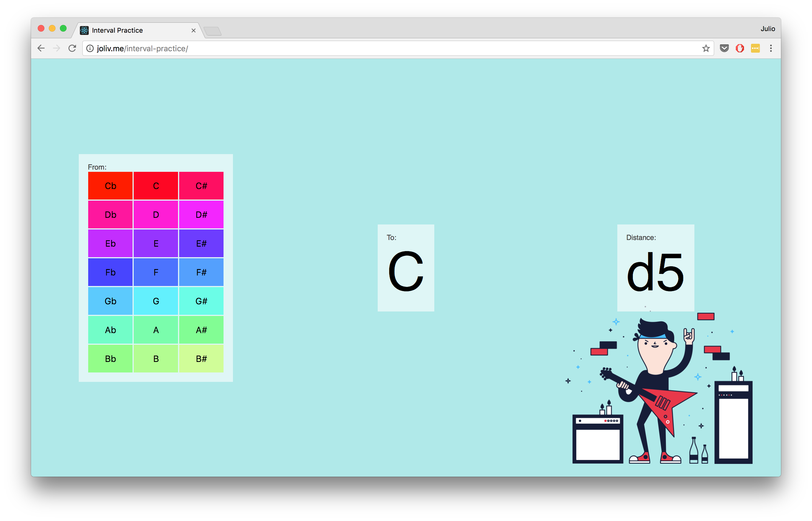

import Layout from 'src/components/layout'

export default function({ children }) {
  return <Layout centered>{children}</Layout>
}

# [rlox](https://rlox-wasm.now.sh/)

Intérprete de Lox del libro [Crafting Interpreters](http://www.craftinginterpreters.com/), escrito
en Rust y compilado a WebAssembly.

# [Interval Practice](http://joliv.me/interval-practice/)

Herramienta para aprender y practicar intervalos entre notas musicales.

# [POM-Odoro](http://joliv.me/POM-Odoro/)

Pequeño timer para seguir la [Técnica Pomodoro](https://es.wikipedia.org/wiki/T%C3%A9cnica_Pomodoro)

# [CH₃CH₂CH₂CH₂CH₃anges](http://blaquenkot.github.io/game-off-2013/)

Juego para el [Github's Game Off II](https://github.com/blog/1674-github-game-off-ii)

